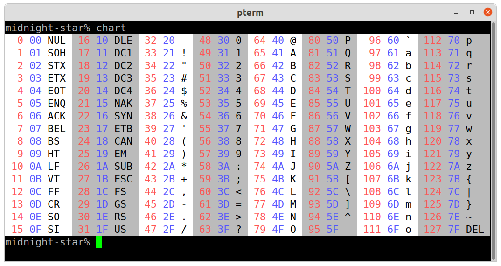

This program prints a colorized chart of all 128 ASCII characters to
stderr.  Assumes that the terminal supports ANSI color escapes.
Assumes the terminal is at least 80 columns wide.



## Building

Can be built in the normal way with either Cabal or Stack.

If you're unfamiliar with Haskell, I recommend using Stack.  Just
[install Stack](https://docs.haskellstack.org/en/stable/#how-to-install-stack)
and then it will take care of downloading known-to-work versions of
[GHC](https://www.haskell.org/ghc/) and other tools automatically (in
a sandbox) as needed.

Once you have `stack` installed, do:

```
cd ~/some/where
git clone https://github.com/mignon-p/hs-ascii-chart.git
cd hs-ascii-chart
stack build
stack run chart
```

To install `chart`, do:

```
stack install
```

By default, Stack will install the executables in `~/.local/bin`.
So you'll want to make sure that `~/.local/bin` is on your `PATH`.

## Using as a script

If you have `runhaskell` on your `PATH` (`runhaskell` is part
of a GHC installation), then you can just copy `chart.hs` to a
location on your `PATH`, and run it as a script.

If you run it as a script, it takes about a quarter of a second to
start up.  If you precompile it, as above, then it runs virtually
instantaneously.
